# Resultados Teóricos
## Primer test

## Segundo test
### Primer intento 6/8

### Segundo intento

## Tercer test

# Capturas de "demos"

## Demo-01
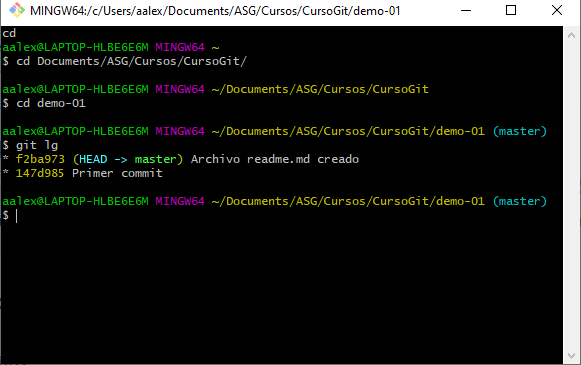

## Demo-02

## Demo-03
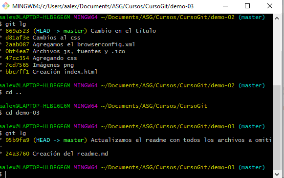

## Demo-04
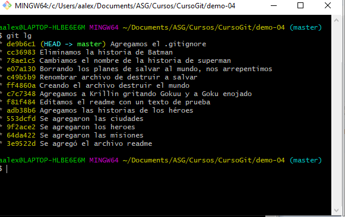

## Demo-05
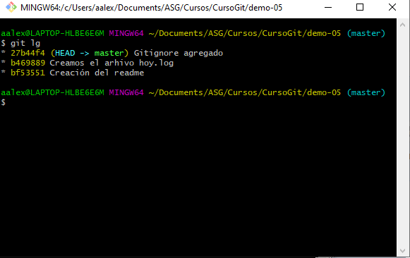

## Demo-06
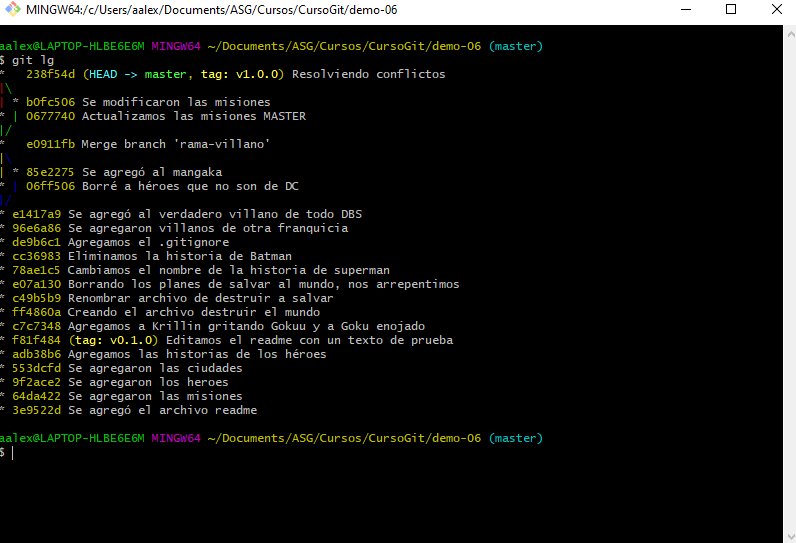

## Demo-07
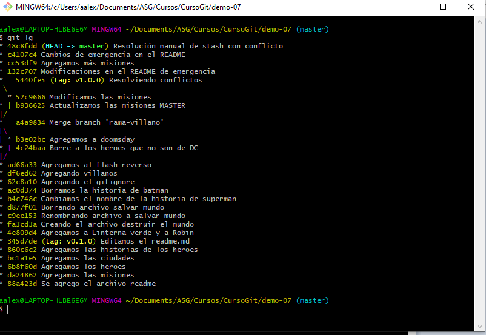

## Demo-08

## Demo-09
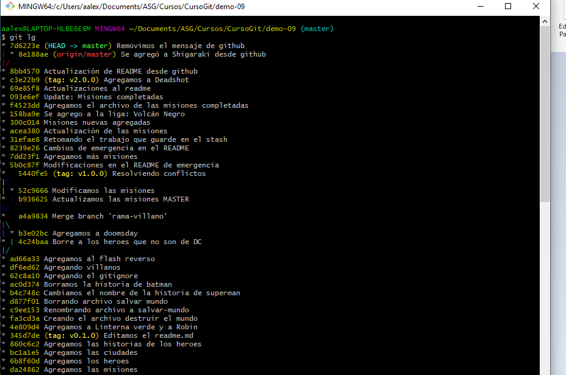
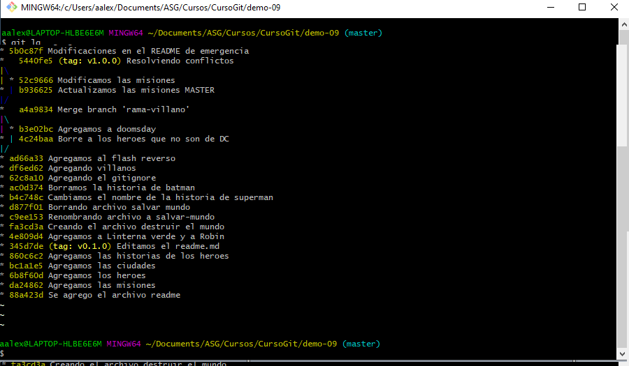

## Demo-10
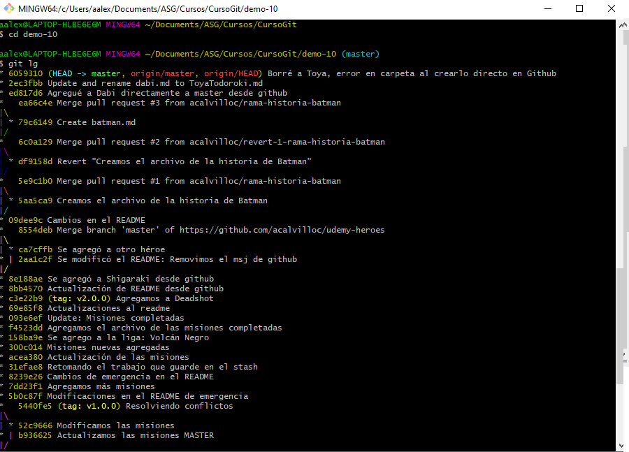
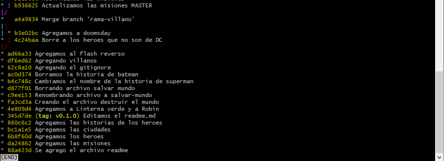

## Demo-11
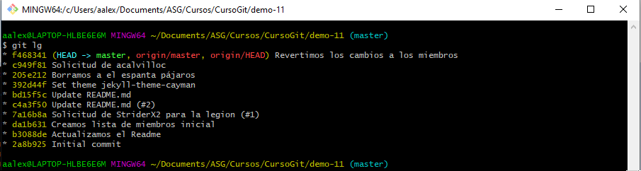

## Demo-12
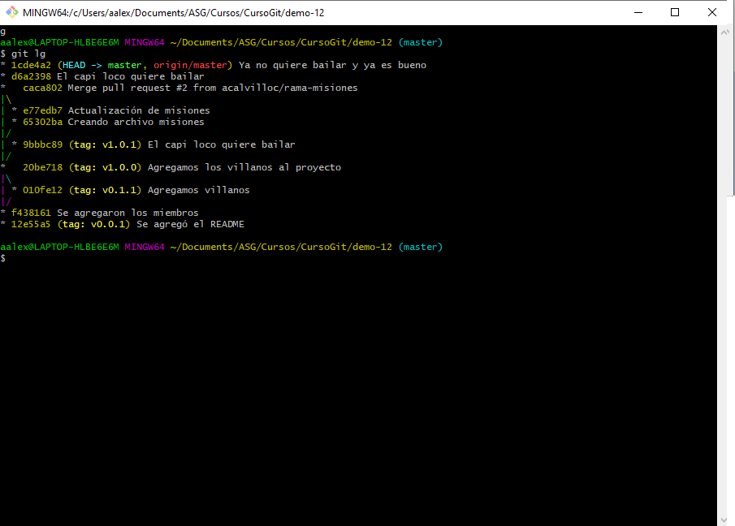